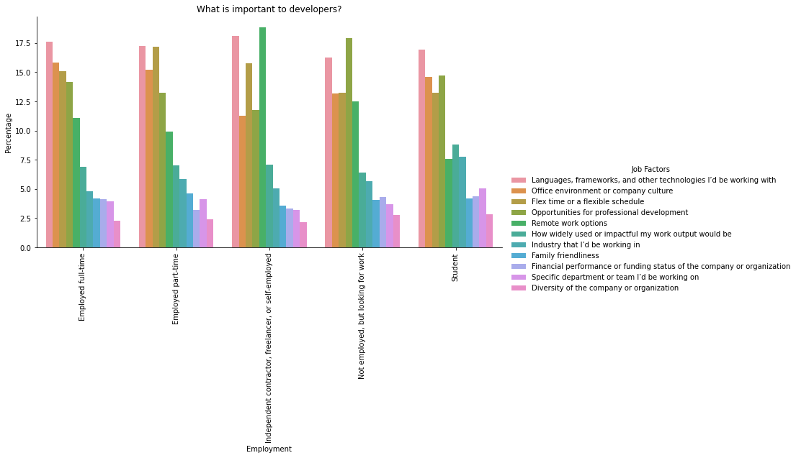
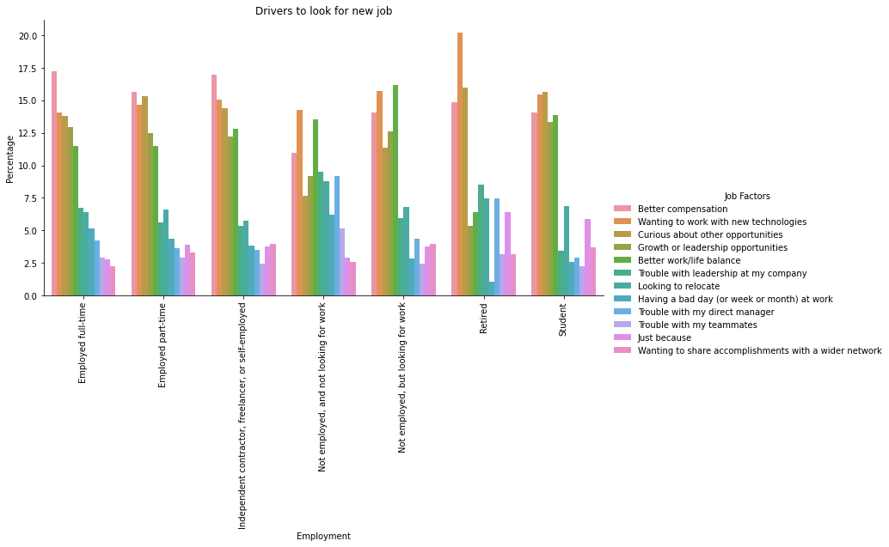
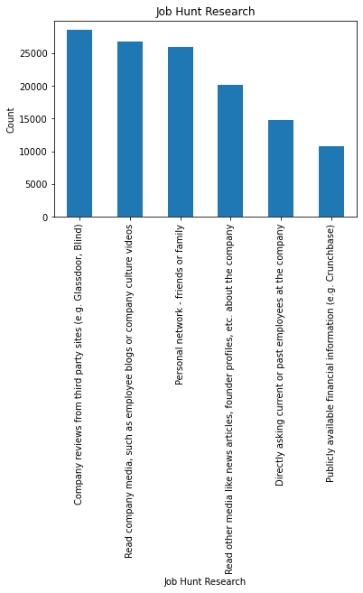
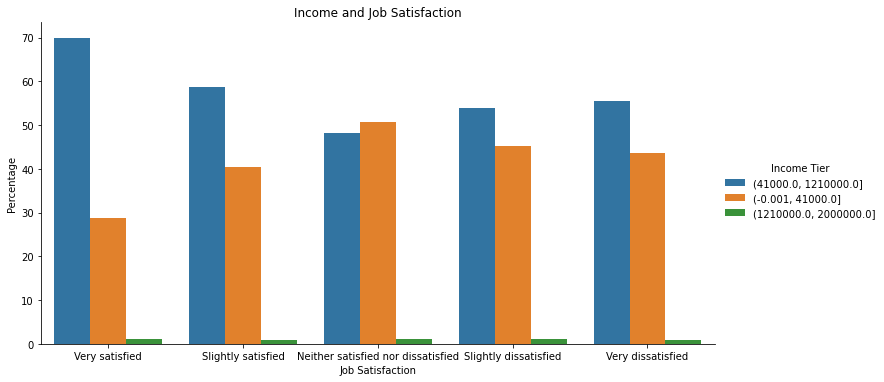
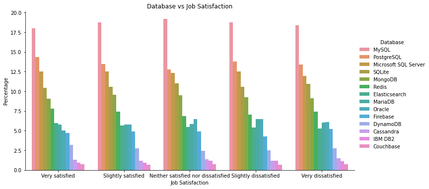
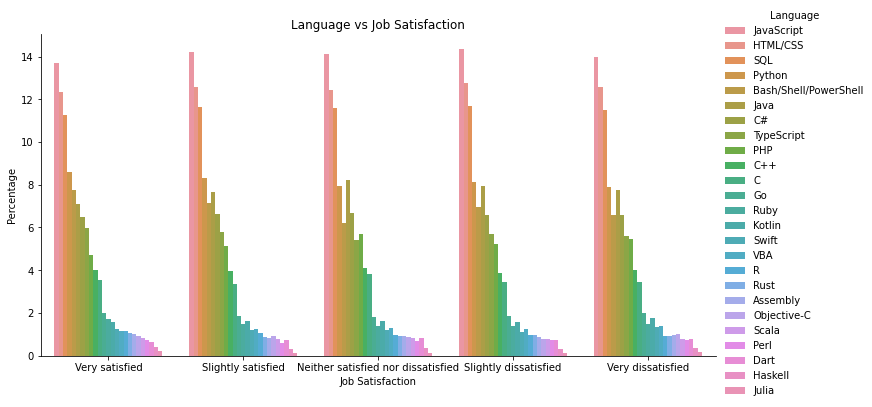
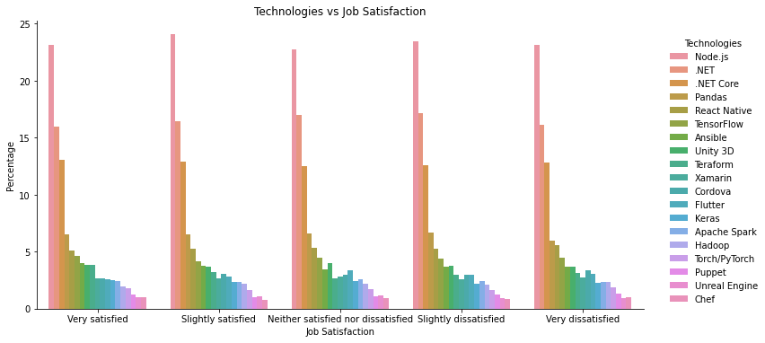
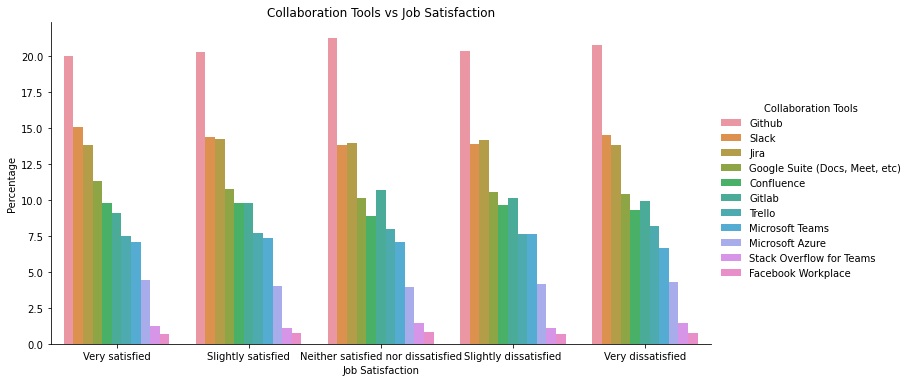
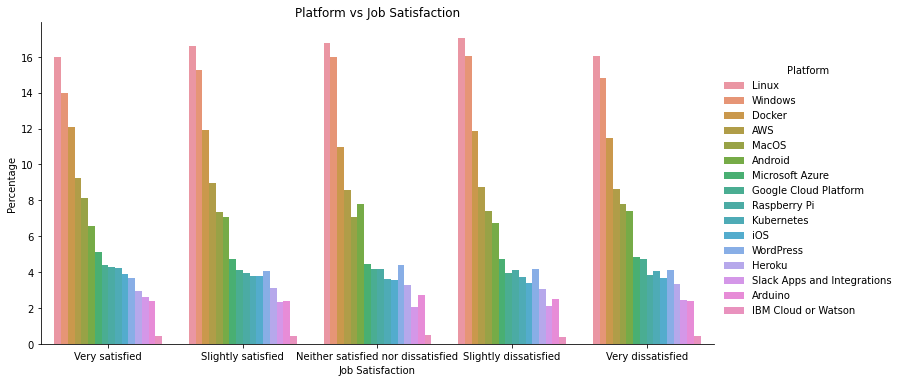
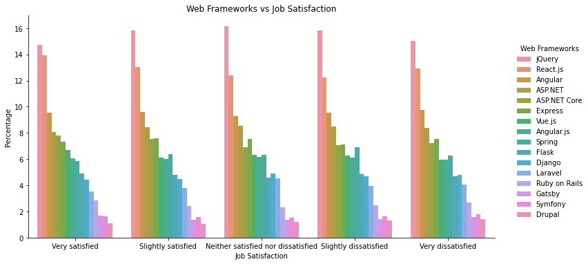

# Designing the Perfect IT Company

## _An exploration analysis on Stack Overflow's 2020 survey_

Our company has conducted a survey to gain insights on its developers' job satisfaction levels. I was thinking, if we can get this literally outside the box, by analyzing developer's responses to Stack Overflow's survey.

My initial thought is that we can perhaps resolve things by simply giving employee a promotion or a raise, or getting the best combinations of new technologies to attract developers outside to join the company. However, these factors are very difficult to control when starting your own company. There could be other factors that we can to look at.

I used the Stack Overflow's 2020 survey data which covers 64,000 respondents from over 180 countries, mostly from the United States and India. This survey examines several aspects of developer experience from career satisfaction and job search to education and opinions on open source software.

### What do the developers look for a company?

> _"Which of the following best describes your current job-seeking status?"_

Before we dig in to the data, we need to look at the current job seeking status of the respondents, especially those who are currently employed.

The graph suggests that **unless developers are very satisfied with their current job, they are keeping their options open**. The trend also shows that the lower the satisfaction rating, the more that they are actively looking for a job, claiming the second spot as high as 30% on the lowest satisfaction. This would mean that we need to keep our developers' satisfaction as high as possible as any dip in the satisfaction may mean that we can lose our people anytime.

> _"Imagine that you are deciding between two job offers with the same compensation, benefits, and location. Of the following factors, which 3 are MOST important to you?"_

The next thing to look at is the factors that developers consider to be important in their job. The survey question will also help us determine what other factors attract developers to join a company when compensation, benefits and location are out of the question.

The **languages, frameworks or technologies** used in the company is among the top 3 on all different employment status. Contractors or freelancers value **remote work options** more than anything, and it's also among the top 5 across different groups. Those who are currently not employed would like to seek more on **opportunities for professional development**.

Another interesting information here, as well, is that students value the kind of **languages that they are going to use** as this will mark the start of an experience where they are going to invest their knowledge and use it as a leverage to progress in their career. The survey implies that one way to attract fresh graduates from colleges is to give them the newest technologies or should I say the "cool stuffs" to work with right away.

The survey that was conducted last 2020 was also the start of pandemic period, and we can see that the developers are valuing the importance of **remote work options** and **flexible schedule** as we can see they are among the top 5 across different types of employment. This may mean that, even after the pandemic, the company should make these work setup options permanent.

> _"In general, what drives you to look for a new job?"_

Now we are moving in to what company fears: drivers that make developers move to another company. This can also play in their favor since they will get ideas on how to attract outside developers.

It's so far aligned with what is initially thought of, that **better compensation** is the primary factor in switching jobs. This is immediately followed by the technologies that they are going to work with. One notable group is those who are currently unemployed because they are looking for a **better work/life balance**. Still for students, along with being curious about opportunities, they are still primarily looking for job that offers new technologies.

> _"When job searching, how do you learn more about a company?"_

Before we move on, let's have a quick look on the advertisement part with the survey question above.

Looking for a job is not like just buying over Amazon. Job seekers perform intensive research when looking for a job. Primary means of research is through **real employee reviews** via Glassdoor or Blind, followed by **reports from media or blogs**. We can add this to our recipe for our perfect company, taking note of employee reviews on these websites.

### Is salary or languages/technologies/frameworks effective enough to solve job satisfaction issues?

Your best developer just filed his resignation, should I just straight up offer him a raise? Or reassign him to a "cool project"? These could be the common solutions that are thought up to solve developer's satisfaction. Based on our previous analysis, developers are consistently looking for better compensation or technologies they'd like to work on.

Despite the big gap on incomes under very satisfied group, having a **higher salary still does not guarantee job satisfaction** as those with higher salary still shows mostly even on the lowest satisfaction rating. Do note that the income tier bins are based on 2020 US Income Tier which classifies who belongs to Low, Middle and High Class.

This has also the same pattern with the languages, technologies and frameworks used by the company.

As you can see in the graphs above they are all consistently distributed across different satisfaction level. This means that having the coolest technologies or frameworks does not also guarantees job satisfaction either.

### What other hidden factors affects job satisfaction?

If giving raises, promotions, or having the coolest technologies does not guarantee satisfaction, maybe there are some hidden factors in the survey data that affects job satisfaction.

To find this out, I first simplified the job satisfaction into `boolean`. Meaning if they belong under `Very Satisfied` and `Slightly Satisfied`, they are classified as currently satisfied with their job (`true`), otherwise `false`.

After I simplified the job satisfaction variable, I went ahead and handpicked the fields that is relevant to job, and remove those that are not (e.g. questions pertaining to the usage of StackOverflow). I then fed these information to train a logistic regression model and get the top 20 things that has high correlation with job satisfaction. The results surprised me.

  * The top result is if the company has a **good onboarding process**. This apparently have a high correlation to Job Satisfaction at 0.81.
  * Most of the top results shows that living on a certain country also results to higher job satisfaction. The **top countries are Finland, Belgium, United States, Sweden and Denmark**. Most of these are European countries.

### Conclusion

In this post, we examined various factors that developers are looking for in a company and their actual satisfaction status based on different criteria, based on Stack Overflow 2020 survey. 

1. **Better compensation and having the cool technologies** are the things that developers look for in a job. Depending on the employment status, some of the important things are shifted, for example, **contractors value remote work and flexible schedule** more. Lastly, a way to attract fresh graduates nowadays is to offer them cool technologies, as their initial concern is to establish a solid experience on these technologies.

2. Having a good compensation package or offering the cool technologies will not guarantee developer's job satisfaction. I believe having a good balance with the other factors such as **growth and opportunities, work and life balance, remote work, flexible schedule** is still the best answer to guarantee satisfaction among developers. Another way to improve these observation is to create multivariate analysis that includes these other factors to solidify the theory.
3. We can include quick wins in designing the perfect company, such as **offering a good onboarding process** and **listening and maintaining good reviews** in websites such as `GlassDoor` and `Blinds`. Country also plays a factor in developer's satisfaction, so we need to look into this, as well. Additionally, traditions and lifestyles in these countries could potentially affect developers satisfaction.

Still, there are more things we can try to design the perfect company. All things stated here are pure observations and not as a result of a formal study. There's still more that we can explore, to craft the PERFECT COMPANY.
