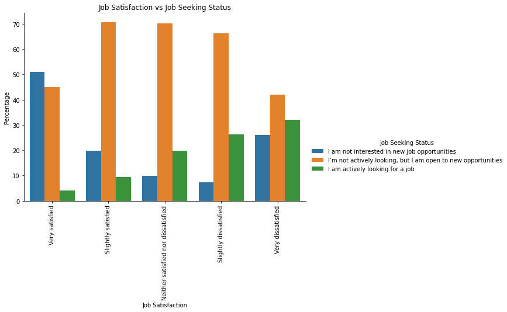

# Designing the Perfect IT Company

## _An exploration analysis on Stack Overflow's 2020 survey_

Our company is giving out survey for us developers on our current job satisfaction. I was thinking, if we can get this literally outside the box, by analyzing developer's responses to Stack Overflow's survey.

My initial thoughts is that we can perhaps resolve things by simply giving employee a promotion or raise, or getting the best combinations of new technologies to attract developers outside to join the company. However, these factors are very difficult to control when starting your own company. There could be other factors that we need to look at.

I used the most recent Stack Overflow's 2020 survey data which covers 64,000 respondents from over 180 countries mostly from United States and India. This survey examines all aspects of developer experience from career satisfaction and job search to education and opinions on open source software.

### What do the developers look for a company?

> _"Which of the following best describes your current job-seeking status?"_

Before we dig in to the data, we need to look at the current job seeking status of the respondents, especially those who are currently employed. 

The graph suggests that unless developers are very satisfied with their current job, they are keeping their options open. The trend also shows that the lower the satisfaction, the more that they are actively looking for a job, claiming the second spot as high as 30% on the lowest satisfaction. This would mean that we need to keep our developers' satisfaction as high as possible as any dip in the satisfaction may mean that we can lose the developer anytime.

> _"Imagine that you are deciding between two job offers with the same compensation, benefits, and location. Of the following factors, which 3 are MOST important to you?"_

The next thing to look at is the things that are very important to developers in their job. The survey question also, will help us know what attracts developers when compensation, benefits and location are out of the question.

The languages, frameworks or technologies used in the company is among the top 3 on all different employment status. Contractors or freelancers value remote work options more than anything, and it's also among the top 5 across different groups. Also, those who are currently not employed would like to seek more on opportunities for professional development.

Another interesting information here as well is that students values the kind of languages that they are going to use as this will mark their start of experience where they are going to invest their knowledge to as they progress in their career. This is also a good way to attract those fresh from colleges by giving them the newest technologies or I should say "cool stuff" to work with right away.

The survey that was conducted last 2020 was also the start of pandemic period, and we can see that the developers are valuing the importance of remote work options and flexible schedule as we can see they are among the top 5 across different types of employment. This may also mean that, even after pandemic, we may start considering having these work setup options permanent.

> _"In general, what drives you to look for a new job?"_

Now we are moving in to what company fears off, drivers that make developers move. This can also play in their favor in attracting outside developers.

It so far aligned with what is initially thought of, that better compensation is the primary factor on switching jobs. This is immediately followed by the technologies that they are going to work with. Some notable group was that those who are currently unemployed, they are looking for a better work/life balance. Still for students, along with being curious about opportunities, they are still primarily looking for job that offers new technologies.

> _"When job searching, how do you learn more about a company?"_

Before we move on, let's have a quick look on the advertisement part with the survey question above.

Looking for a job is not like just buying over Amazon. Job seekers performs intensive research when looking for a job. Primary means of research is through real employee reviews via Glassdoor or Blind, followed by reports from media or blogs. We can add this to our recipe for our perfect company, keeping and listening to employee reviews on these websites.

### Is salary or languages/technologies/frameworks effective enough to solve job satisfaction issues?

Your best developer just filed his resignation, should I just straight up offer him a raise? Or reassign him to a "cool project"? These are some of the things that's maybe running in our mind that having these 2 will just straight up solve developer's satisfaction. Based on our previous analysis, developers are consistently looking for better compensation or technologies they'd like to work on.

Despite the big gap on incomes under `very satisfied` group, having a higher salary still does not guarantee job satisfaction as those with higher salary still shows mostly even on the lowest satisfaction rating. Do note that the income tier bins are based on 2020 US Income Tier which classifies who belongs to Low, Middle and High Class.

This has also the same pattern with the languages, technologies and frameworks used by the company.

As you can see in the graphs above they are all consistently distributed across different satisfaction level. This means that having the coolest technologies or frameworks does not also guarantees job satisfaction.

### What other hidden factors affects job satisfaction?

If giving raises or promotions, or having the coolest technologies does not guarantee satisfaction, maybe there are some hidden factors in the survey data that affects job satisfaction.

To find this out, I first simplified the job satisfaction into `boolean`. Meaning if they belong under `Very Satisfied` and `Slightly Satisfied`, they are classified as currently satisfied with their job (true), otherwise false.

After I simplified the job satisfaction variable, I went ahead and handpicked the fields that is relevant to job, example of this are those questions pertaining to the usage of StackOverflow. I then fed these information to train a `logistic regression` model and get the top 20 things that has high correlation with job satisfaction. The results surprised me.

* The top result was if the company has a good onboarding process. This apparently have a high correlation to Job Satisfaction at 0.81.
* Most of the top results shows that living on a certain country also results to higher job satisfaction the top countries to work at are Finland, Belgium, United States, Sweden and Denmark. Most of these are European countries.
* The result also shows the negative correlation when working in China or Egypt

### Conclusion

In this post, we discussed various things that developers are looking for in a company and the actual satisfaction status based on different factors, based on Stack Overflow 2020 survey data.

1. Better compensation and having the cool technologies are the things developers are looking for in a job. Depending on the employment status, some of the important things are shifted, for example, contractors value remote work and flexible schedule more. Lastly, a way to attract students nowadays is by offering them cool technologies, as their initial concern is to establish a solid experience on these technologies.
2. Even if having a good salary nor offering the cool technologies, it will not guarantee developer's satisfaction. I believe having a good balance with the other factors such as growth and opportunities, work and life balance, remote work, flexible schedule is still the best answer to guarantee developer's satisfaction. Another way to improve these observation is to create multivariate analysis that includes these other factors to solidify the theory.
3. We can include quick wins in designing the perfect company, such as offering a good onboarding process and listening and maintaining good reviews in websites such as GlassDoor and Blinds. Country also plays a huge factor in developer's satisfaction, so we need to factor this as well and look more closely into the traditions and lifestyles that may affect developers satisfaction.

Still, there are more things we can try to design the perfect company. All things stated here are pure observations and not as a result of a formal study. There's still more that we can explore, to craft the PERFECT COMPANY.
